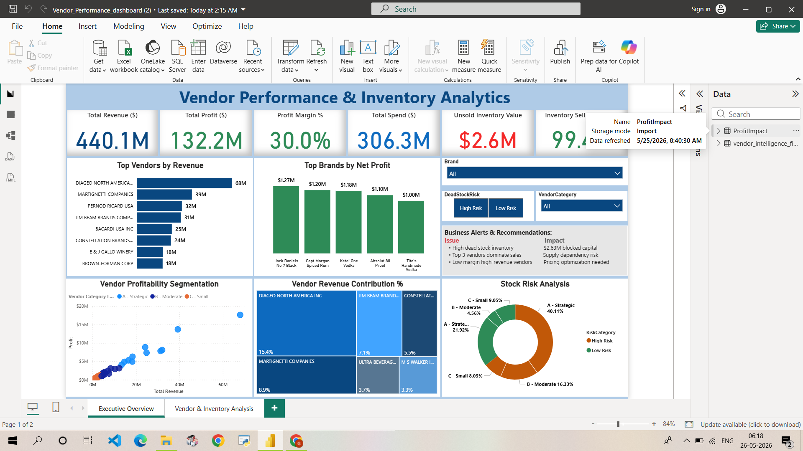
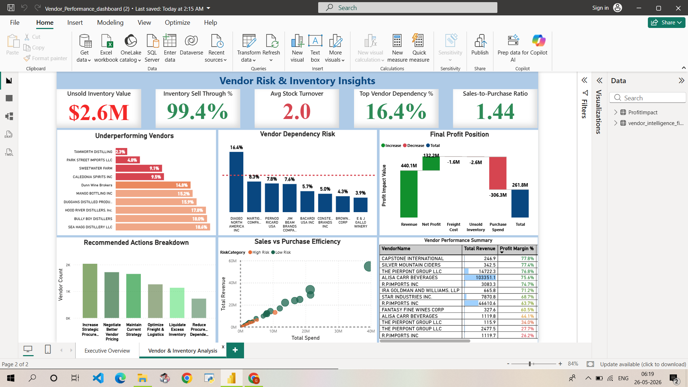

# Vendor Intelligence & Procurement Optimization Analytics System

An end-to-end business analytics project focused on improving **vendor performance, procurement efficiency, inventory management, and profitability optimization** using **SQL, Python, and Power BI**.

---

## 📌 Project Overview

This project analyzes procurement, inventory, purchase, and sales data to generate **actionable business insights** that help organizations:

* Optimize vendor performance
* Reduce procurement inefficiencies
* Improve inventory management
* Monitor freight and operational costs
* Increase profitability through data-driven decision-making

The project transforms raw transactional data into meaningful insights using:

* SQL for data extraction and business analysis
* Python for exploratory data analysis (EDA)
* Power BI for interactive dashboard visualization

---

## 🎯 Objectives

* ✔ Evaluate vendor performance using KPIs
* ✔ Identify high and low-performing vendors
* ✔ Analyze inventory efficiency and unsold capital
* ✔ Monitor freight and operational expenses
* ✔ Analyze sales contribution and profitability
* ✔ Build interactive dashboards for business decision-making

---

## 🛠 Tools & Technologies

| Tool                       | Purpose                               |
| -------------------------- | ------------------------------------- |
| **SQLite / SQL**           | Data cleaning & business analysis     |
| **Python (Pandas, NumPy)** | Data preprocessing & EDA              |
| **Matplotlib & Seaborn**   | Data visualization                    |
| **Power BI**               | Interactive dashboard & KPI reporting |
| **Jupyter Notebook**       | Analysis environment                  |

---

## 📂 Project Structure

```text
Vendor Intelligence & Procurement Optimization Analytics System/
│
├── cleaned_data/
│   └──vendor_intelligence_final.csv
│
├── Data/
│    ├──begin_inventory.csv
│    ├──end_inventory.csv
│    ├──purchase_prices.csv
│    └──vendor_invoice.csv 
│
├── PowerBI/
│   ├── Vendor_Performance_Dashboard.pbix
│   └── Dashboard_Screenshots/
│       ├── dashboard_page1.png
│       └── dashboard_page2.png
│
├── Python_EDA/
│   └── Vendor_Performance_PyEDA.ipynb
│
├── Scripts/
│   ├── SQL_Vendor_Performance.py
│   └── Vendor_Performance_PyEDA.py
│
├── SQLite_EDA/
│   └── SQL_Vendor_Performance.ipynb
│
└── README.md
```

---

## 🔄 Project Workflow

### 1️⃣ Data Collection & Database Setup

* Imported procurement, sales, inventory, and vendor datasets
* Built SQLite database for structured analysis

### 2️⃣ Data Cleaning & SQL Analysis

* Performed data validation and cleaning
* Created joins across multiple tables
* Calculated business KPIs and vendor metrics

### 3️⃣ Exploratory Data Analysis (Python)

* Performed detailed EDA
* Identified trends and patterns
* Conducted profitability and inventory analysis

### 4️⃣ Visualization & Dashboard Development

* Built interactive Power BI dashboards
* Designed KPI-driven business reporting visuals

### 5️⃣ Business Insight Generation

* Generated strategic recommendations for optimization

---

## 📊 Dashboard Preview

<p align="center">
  
</p>

<p align="center">
  
</p>

---

## 📈 Analysis Performed

* ✔ Vendor performance analysis
* ✔ Procurement cost analysis
* ✔ Freight cost analysis
* ✔ Inventory & unsold stock analysis
* ✔ Gross profit analysis
* ✔ KPI calculations
* ✔ Sales trend analysis
* ✔ Vendor contribution analysis
* ✔ Purchase contribution analysis
* ✔ Profitability analysis
* ✔ Product-level performance analysis
* ✔ Business recommendation generation

---

## 🔍 Key Insights

* 📌 A small number of vendors contributed the majority of total sales
* 📌 Several products showed high inventory but low sales performance
* 📌 Freight costs significantly impacted overall profitability
* 📌 Unsold inventory increased holding and operational costs
* 📌 Gross profit margins varied considerably across vendors and products
* 📌 Some vendors generated high sales but low profitability

---

## 💡 Strategic Recommendations

* ✔ Optimize inventory for slow-moving products
* ✔ Reduce freight costs through vendor negotiation
* ✔ Focus on high-margin vendors and products
* ✔ Improve procurement planning using sales trends
* ✔ Monitor unsold inventory regularly
* ✔ Strengthen vendor evaluation using KPI tracking

---

## 📦 Project Deliverables

* ✔ SQL scripts for business analysis
* ✔ SQLite database
* ✔ Python EDA notebook (`.ipynb`)
* ✔ Python scripts (`.py`)
* ✔ Power BI dashboard (`.pbix`)
* ✔ Dashboard screenshots
* ✔ Cleaned datasets

---

## ▶️ How to Run This Project

1. Clone this repository
2. Open SQLite database and execute SQL scripts
3. Open `Vendor_Analysis.ipynb` in Jupyter Notebook or VS Code
4. Install required Python libraries
5. Open `.pbix` file in Power BI Desktop

---

## 👩‍💻 Author

**Gayatri Baruwal**
Aspiring Data Analyst

Skilled in: **SQL | Python | Power BI | Machine Learning**

---

## 📬 Contact Me

🔗 **LinkedIn:** https://www.linkedin.com/in/gayatri-baruwal-92669b231

📧 **Email:** [gayatrixtri314@gmail.com](mailto:gayatrixtri314@gmail.com)

---

⭐ *If you found this project useful, feel free to star the repository!*
